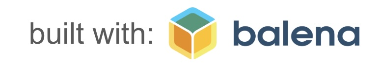
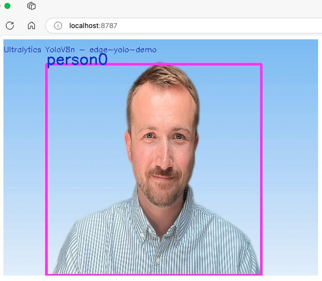

# bootstrap-edge-yolov8



- [bootstrap-edge-yolov8](#bootstrap-edge-yolov8)
  - [Quick Start](#quick-start)
    - [Native Environment](#native-environment)
    - [Docker Desktop (using: Docker Compose)](#docker-desktop-using-docker-compose)
    - [Edge Device Deployment (using: BalenaCloud \& BalenaOS)](#edge-device-deployment-using-balenacloud--balenaos)
  - [Building / Modifying Code](#building--modifying-code)
  - [Resources / References](#resources--references)


This is a demo project showcasing how to deploy a YOLOv8n model to an Embedded Linux device, primarily using Containers (BalenaOS & BalenaCloud).

This project can serve as a template framework for Machine Vision and Robotics based applications, and can be deployed on any Embedded Linux target with a Python Interpreter installed.

The solution is scalalable so that it can be extended with additional models & camera interfaces and utilised as a `.whl` library distributed by a Package Manager.

If you're building a distributed compute or robotics application & require remote fleet management of 100,000+ devices, consider using [www.balena.io](www.balena.io).

## Quick Start

### Native Environment

```bash
git clone https://github.com/samuel-duffield1/bootstrap-edge-yolov8.git && \
cd bootstrap-edge-yolov8 && \
python3.11 -m venv venv && \
source venv/bin/activate && \
pip install -e . && \
LOCAL_CAMERA_SOURCE=0 bootstrap_edge_demo
```

> ‼️ NOTE: You may want to change `LOCAL_CAMERA_SOURCE` to an appropriate integer on your Windows, Mac or Linux machine via the appropriate methods (e.g. `/dev/videoX`)

Output:



The model also outputs approximate x/y cooordinates of the location of the target which can be used to driver motors/steppers in Robotics applications.

```json
{
  "x": 285,
  "y": -246,
  "confidence": 0.94,
  "pixels_wide": 640,
  "pixels_high": 480,
  "field_of_view_w": 90,
  "field_of_view_h": 90,
  "class_name": "person",
  "unique_name": "person0"
}
```

### Docker Desktop (using: Docker Compose)

```bash
cd bootstrap-edge-yolov8 && \
docker compose up
```

> ‼️ NOTE: Running this application on Docker Desktop is only possible on a Linux OS such as Ubuntu. This is due to the nature in which video drivers are implemented in Windows & MacOS and their default implementations in OpenCV.


### Edge Device Deployment (using: BalenaCloud & BalenaOS)
1. Create a free account at [www.balena.io](www.balena.io) and follow the [Getting Started Guide](https://docs.balena.io/learn/getting-started/raspberrypi5/python/) to create your first fleet and provision a device with the BalenaOS operating system.

2. [Install the BalenaCLI](https://github.com/balena-io/balena-cli/blob/master/INSTALL.md) for your development machine.

3. Push this application to your Embedded Linux Device using the BalenaCLI:

```bash
balena push <your-balena-orgname>/<your-balena-fleet-name>
```

## Building / Modifying Code

Clone this repository to your machine:
```
git clone https://github.com/samuel-duffield1/bootstrap-edge-yolov8.git
```

Create a local `venv` and install the Python Package as editable within your environment, such that `vscode` (and other IDEs) can support your development with intellisense while you edit your Python code live:

```bash
cd bootstrap-edge-yolov8 && \
python3.11 -m venv venv && \
source venv/bin/activate && \
pip install -e .
```


## Resources / References
The Yolo v8n model used in this demo is provided by [Ultralytics](https://docs.ultralytics.com/models/yolov8/#overview). All rights reserved.


